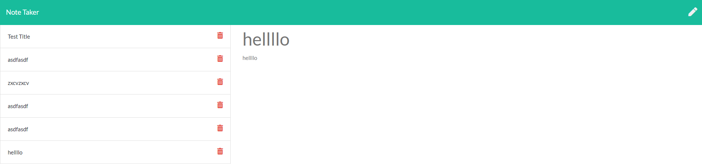

# 
NoteTaker

The purpose of this app is to provide the ability to take notes. The data will persist until the user decides to delete the data. 
* https://github.com/malhill/NoteTaker
* https://malhill.github.io/NoteTaker/
* https://immense-refuge-91483.herokuapp.com/

## HTML 
* The material was provided

## CSS
* The material was provided 

## JS
* Most of the material was provided 
* Added 'let idNum = 1;' to index.js on line 8
* Then added 'id: idNum' on line 51
* This was needed to add the id to the notes posted
* Added idNum++ to add an extra id number for each note created

## BACK-END
* Needed to connect the back end edits to the front end
* Utilizing: Expess, Node, and NPM packages to help the app function
* Utilizing: GET, POST, and DELETE request methods
* Learned to create a for loop so that I can cycle through the ids without them deleting more than one.
